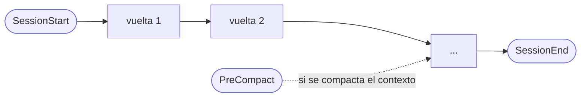
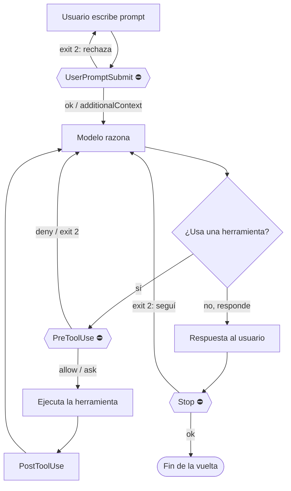
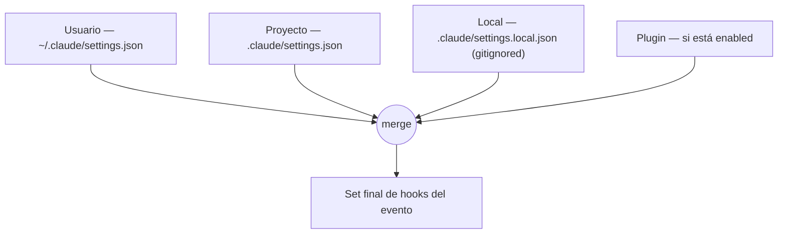

# Hooks de Claude Code — referencia de mecánica

Documento de referencia sobre **cómo funcionan los hooks** de Claude Code: qué evento se dispara en cada punto del ciclo de una vuelta, qué recibe cada uno, cómo devuelve control, y cómo se configura. De alto a bajo nivel.

Escrito para que sirva de referencia tanto a una persona como a otro agente. Verificado contra la doc oficial (`code.claude.com/docs/en/hooks`) y contra los hooks reales que corren en esta PC (plugin caveman + lint de proyecto). Lo que no se pudo confirmar está marcado explícitamente.

> **Este documento es el "cómo funciona".** El **"cuánto cuesta"** (latencia de cada mecanismo, presupuesto por evento bloqueante, elección de intérprete) vive en [`latencia-hooks.md`](latencia-hooks.md) — no se duplica acá.

---

## 1. Qué es un hook

Un **hook** es un comando externo (script, HTTP, etc.) que Claude Code ejecuta automáticamente **en un momento fijo del ciclo de vida** de una sesión. No lo llama el modelo: lo dispara el harness. Sirve para tres cosas:

| Uso | Ejemplo real |
|-----|--------------|
| **Inyectar contexto** al modelo | El hook `UserPromptSubmit` del caveman agrega "CAVEMAN MODE ACTIVE" a cada mensaje |
| **Bloquear / validar** una acción | Un `PreToolUse` que niega `Bash(rm *)` antes de que corra |
| **Reaccionar** a un evento (efecto de lado) | El `SessionStart` de este repo corre `lint-planes` al abrir sesión |

El hook se comunica con el harness por un **contrato de proceso**: recibe un **JSON por stdin**, y devuelve control por su **exit code** y (opcionalmente) un **JSON por stdout**. Nada más. No hay API in-process.

---

## 2. El ciclo de una vuelta — dónde entra cada evento

Hay **dos escalas**. La de la sesión (abre → varias vueltas → cierra) y la de **una vuelta** (prompt → respuesta). Se muestran por separado para que cada diagrama quede legible.

**Escala de sesión** — eventos de frontera, lineales:



**Escala de una vuelta** — el bucle prompt → modelo → herramientas → respuesta, con cada hook en su punto:



> **⛔ = evento bloqueante** (nodos hexagonales): corre en el camino crítico y puede frenar la acción — ver §4.
> `SubagentStop` (⛔) es el gemelo de `Stop` dentro de un subagente. `Notification` es transversal: dispara cuando el harness avisa algo (pide permiso, sesión inactiva), fuera de este bucle.

Lectura en prosa:

1. **`SessionStart`** — al abrir, reanudar o limpiar la sesión. Punto para cargar contexto de arranque o correr un chequeo (el lint de este repo).
2. **`UserPromptSubmit`** — apenas el usuario manda el mensaje, **antes** de que el modelo lo vea. Punto para inyectar reglas por turno o rechazar el prompt.
3. **`PreToolUse`** — el modelo decidió usar una herramienta, **antes** de ejecutarla. Punto para validar o bloquear (allow / deny / ask).
4. **`PostToolUse`** — la herramienta terminó **con éxito**. Punto para reaccionar al resultado (formatear, avisar). Ya se ejecutó: no puede deshacerla.
5. Se vuelve al modelo; el bucle 3-4 se repite por cada herramienta.
6. **`Stop`** — el modelo terminó de responder. Un hook puede **forzar que siga** (exit 2) en vez de devolver el control.
7. **`SubagentStop`** — como `Stop`, pero al terminar un subagente (Task).
8. **`PreCompact`** — antes de compactar el contexto (manual o automático).
9. **`SessionEnd`** — al cerrar la sesión.
10. **`Notification`** — transversal: cuando el harness emite una notificación (pide permiso, sesión inactiva, etc.).

---

## 3. Los eventos del núcleo — tabla maestra

| Evento | Cuándo dispara | Bloqueante | Campos propios (stdin) | Qué puede hacer |
|--------|----------------|:----------:|------------------------|-----------------|
| **SessionStart** | Abre/reanuda/limpia sesión (una vez) | No | `source` (`startup`\|`resume`\|`clear`\|`compact`) | Inyectar `additionalContext` de arranque; efecto de lado |
| **UserPromptSubmit** | Usuario manda prompt, antes del modelo | **Sí** | `prompt` | Inyectar `additionalContext`; **rechazar** el prompt |
| **PreToolUse** | Modelo va a usar una herramienta | **Sí** | `tool_name`, `tool_input` | **allow / deny / ask**; inyectar contexto |
| **PostToolUse** | Herramienta terminó con éxito | No | `tool_name`, `tool_input`, `tool_response` | Reaccionar; devolver feedback al modelo |
| **Stop** | Modelo terminó de responder | **Sí** | `stop_hook_active` | **Forzar** que el modelo siga trabajando |
| **SubagentStop** | Un subagente (Task) terminó | **Sí** | `stop_hook_active` | Igual que `Stop`, para el subagente |
| **PreCompact** | Antes de compactar contexto | No | `trigger` (`manual`\|`auto`) | Efecto de lado (ej: backup del transcript) |
| **SessionEnd** | Cierre de sesión | No | `reason` | Efecto de lado (cleanup, logging) |
| **Notification** | Harness emite una notificación | No | `message` | Efecto de lado (avisar por otro canal) |

**Campos base** — todos los eventos reciben, además de lo propio:

```json
{
  "session_id": "uuid",
  "hook_event_name": "PreToolUse",
  "transcript_path": "/ruta/al/transcript.jsonl",
  "cwd": "/directorio/de/trabajo"
}
```

> **Bloqueante ≠ lento.** Bloqueante quiere decir que corre en el camino crítico y *puede frenar la acción*. Que se sienta o no depende de la latencia y de cuántas veces dispara — ver [`latencia-hooks.md`](latencia-hooks.md). `PreToolUse` es bloqueante pero imperceptible; `UserPromptSubmit` es bloqueante y se paga en **cada** mensaje.

---

## 4. El contrato de control — cómo el hook manda

El hook comunica su decisión de **dos formas**, de menor a mayor poder.

### 4.1 Vía exit code (lo simple)

| Exit code | Qué hace | Dónde va la salida |
|:---------:|----------|--------------------|
| **0** | Éxito. La acción sigue. Si hay JSON en stdout, se procesa (§4.2) | En `UserPromptSubmit`/`SessionStart`, **stdout crudo se inyecta como contexto** al modelo |
| **2** | **Bloqueo**. Se ignora stdout. `stderr` es el mensaje de error | `stderr` va al **modelo** (para que corrija), no se muestra como salida normal |
| **otro** (1, etc.) | Error **no bloqueante**. La acción sigue igual | Primera línea de `stderr` al transcript; el modelo no se entera |

**Qué significa exit 2 según el evento:**

| Evento | Efecto de exit 2 |
|--------|------------------|
| `UserPromptSubmit` | Rechaza el prompt; se borra la entrada. `stderr` explica por qué |
| `PreToolUse` | Bloquea la herramienta antes de correr |
| `Stop` / `SubagentStop` | Impide que el modelo se detenga: lo obliga a seguir |
| `PostToolUse` | La herramienta **ya corrió** (no se deshace); `stderr` va al modelo como feedback |
| resto (`SessionStart`, `PreCompact`, `SessionEnd`, `Notification`) | Sin efecto de bloqueo; queda como error no bloqueante |

> **Truco del `UserPromptSubmit` en exit 0:** su stdout crudo (sin JSON) se inyecta tal cual como contexto adicional. Por eso un recordatorio de regla fija puede ser un simple `cmd /c type regla.txt` sin emitir JSON — ver [`latencia-hooks.md`](latencia-hooks.md).

### 4.2 Vía JSON por stdout (lo fino)

Con exit 0, el hook puede escribir un JSON en stdout para controlar el flujo con precisión. Campos **comunes** a cualquier evento:

```json
{
  "continue": true,
  "stopReason": "texto si continue es false",
  "suppressOutput": false,
  "systemMessage": "aviso opcional para el modelo"
}
```

- **`continue: false`** — corta el procesamiento después del hook (más fuerte que un deny puntual).
- **`suppressOutput: true`** — no muestra el stdout del hook en el transcript.

Y un bloque **específico por evento**, `hookSpecificOutput`:

**`PreToolUse` — decidir sobre la herramienta:**
```json
{
  "hookSpecificOutput": {
    "hookEventName": "PreToolUse",
    "permissionDecision": "allow | deny | ask | defer",
    "permissionDecisionReason": "por qué",
    "updatedInput": { "campo": "valor" },
    "additionalContext": "texto inyectado al modelo junto al resultado de la tool"
  }
}
```
| `permissionDecision` | Efecto |
|----------------------|--------|
| `allow` | Corre la herramienta sin pedir permiso al usuario |
| `deny` | Bloquea la herramienta; el `reason` va al modelo |
| `ask` | Fuerza el diálogo de permiso al usuario |
| `defer` | Delega la decisión al flujo normal de permisos |

> **`PreToolUse` SÍ inyecta `additionalContext` al modelo** (verificado contra la doc oficial el 2026-07-23, resolvió una discrepancia de fuentes previa). Comportamiento por decisión:
>
> | `permissionDecision` | ¿Inyecta `additionalContext`? | Flujo de permisos | Timing del texto |
> |---|---|---|---|
> | omitir (= `defer`) | **Sí** | normal (el usuario ve el prompt si aplica) | junto al resultado de la tool (post-ejecución) |
> | `defer` | Sí | normal | post-ejecución |
> | `allow` | Sí | **auto-aprueba** (no pide permiso — efecto de lado) | post-ejecución |
> | `deny` | **No** (se descarta; solo llega el `reason`) | bloquea la tool | — |
>
> Para **inyectar sin efecto de lado**: **omitir `permissionDecision`** (o `defer`) — inyecta y deja el flujo de permisos intacto. El `additionalContext` **nunca** llega *antes* de que la tool corra: es un recordatorio **posterior**, no un aviso previo (el aviso estrictamente previo solo se logra bloqueando con `deny`-con-`reason` o `ask`). `updatedInput` reemplaza los args de la tool antes de correrla.

**`UserPromptSubmit` / `SessionStart` — inyectar contexto:**
```json
{
  "hookSpecificOutput": {
    "hookEventName": "UserPromptSubmit",
    "additionalContext": "texto que se agrega al contexto del modelo"
  }
}
```

**Quién ve `additionalContext`:**
- **El modelo:** siempre. Se agrega a su ventana de contexto.
- **La diferencia entre los dos eventos:** `UserPromptSubmit` lo inyecta *después* del prompt del usuario, en esa vuelta; `SessionStart` lo inyecta como contexto de sistema *antes* del primer prompt.

> Este es exactamente el mecanismo del caveman: su hook `UserPromptSubmit` emite `additionalContext` con las reglas del modo en cada mensaje (ver §6.2).

---

## 5. Configuración — cómo se declara un hook

### 5.1 En `settings.json`

Estructura anidada: **evento → matchers → hooks**.

```json
{
  "hooks": {
    "PreToolUse": [
      {
        "matcher": "Bash",
        "hooks": [
          {
            "type": "command",
            "command": "node .claude/hooks/valida-bash.js",
            "timeout": 10
          }
        ]
      }
    ]
  }
}
```

Campos de cada hook:

| Campo | Qué es | Default |
|-------|--------|---------|
| `type` | `command` (lo usual) | — |
| `command` | El comando a ejecutar. Recibe el JSON por stdin | — |
| `timeout` | Segundos antes de matar el hook | (ver nota) |
| `statusMessage` | Texto que muestra la TUI mientras corre | — |

> **El `timeout` se paga entero si el hook se cuelga.** Un hook que no cierra bloquea hasta agotar su timeout, en cada disparo. Por eso conviene declararlo corto y explícito — detalle y episodio real en [`latencia-hooks.md`](latencia-hooks.md).

### 5.2 El `matcher`

Selecciona **qué dispara** el hook dentro del evento. Aplica sobre todo a los eventos de herramienta (`PreToolUse`/`PostToolUse`), donde matchea contra `tool_name`:

| Matcher | Matchea |
|---------|---------|
| `"Bash"` | Solo la herramienta `Bash` (string exacto, case-sensitive) |
| `"Edit\|Write"` | `Edit` o `Write` |
| `"mcp__.*"` | Cualquier herramienta MCP (se evalúa como regex) |
| `""` o omitido | **Todos** — sin filtro |

Regla práctica: si el patrón tiene solo `[A-Za-z0-9_\-|, ]` es match exacto; si tiene otros caracteres (`.`, `*`, `^`) se evalúa como **regex sin anclar**. Los eventos sin herramienta (`UserPromptSubmit`, `Stop`, etc.) normalmente van sin matcher.

### 5.3 Precedencia — de dónde se juntan los hooks

Los settings se combinan (deep merge) en este orden:



- **Todos los hooks que matchean un evento corren en PARALELO**, no en secuencia. Dos hooks del mismo evento no suman latencias: manda el más lento.
- Si dos hooks son idénticos (mismo `command`), se **deduplican**: corre uno solo.
- Cada hook tiene su **propio timeout** (no acumulativo).

### 5.4 En un plugin

Un plugin declara sus hooks en `.claude-plugin/plugin.json` (o `hooks.json`), con el **mismo schema** que `settings.json`. La diferencia: usa la variable **`${CLAUDE_PLUGIN_ROOT}`** en vez de `${CLAUDE_PROJECT_DIR}` para apuntar a sus propios archivos (porque el plugin vive en el cache, no en el repo).

### 5.5 Variables disponibles en el `command`

| Variable | Apunta a |
|----------|----------|
| `${CLAUDE_PROJECT_DIR}` | Raíz del proyecto (path absoluto) — para hooks de repo |
| `${CLAUDE_PLUGIN_ROOT}` | Directorio del plugin — para hooks de plugin (cambia al actualizar) |

---

## 6. Ejemplos reales de esta PC

### 6.1 Hook de proyecto — lint en `SessionStart`

De `.claude/settings.json` de este repo. Corre el lint de planes al abrir sesión (efecto de lado, no bloqueante):

```json
{
  "hooks": {
    "SessionStart": [
      {
        "hooks": [
          { "type": "command", "command": "node .claude/scripts/lint-planes/lint-planes.js --quiet" }
        ]
      }
    ]
  }
}
```

Sin `matcher` (corre en todo arranque). El `--quiet` evita ruido si no hay hallazgos.

### 6.2 Hook de plugin — inyección de contexto en `UserPromptSubmit`

Del plugin **caveman** (`.claude-plugin/plugin.json`): declara dos eventos, con `${CLAUDE_PLUGIN_ROOT}`, `timeout` y `statusMessage`.

```json
{
  "hooks": {
    "SessionStart": [
      { "hooks": [{ "type": "command",
          "command": "node \"${CLAUDE_PLUGIN_ROOT}/hooks/caveman-activate.js\"",
          "timeout": 5, "statusMessage": "Loading caveman mode..." }] }
    ],
    "UserPromptSubmit": [
      { "hooks": [{ "type": "command",
          "command": "node \"${CLAUDE_PLUGIN_ROOT}/hooks/caveman-mode-tracker.js\"",
          "timeout": 5, "statusMessage": "Tracking caveman mode..." }] }
    ]
  }
}
```

Y el hook `UserPromptSubmit` por dentro — el patrón **stdin JSON → lógica → stdout JSON** completo:

```js
let input = '';
process.stdin.on('data', chunk => { input += chunk; });
process.stdin.on('end', () => {
  const data = JSON.parse(input);          // recibe el JSON del harness
  const prompt = (data.prompt || '').trim().toLowerCase();  // campo propio del evento
  // ... lógica: detecta /caveman, escribe un archivo de flag ...
  const activeMode = readFlag(flagPath);
  if (activeMode) {
    process.stdout.write(JSON.stringify({   // devuelve control por stdout
      hookSpecificOutput: {
        hookEventName: "UserPromptSubmit",
        additionalContext: "CAVEMAN MODE ACTIVE (" + activeMode + "). Drop articles/filler..."
      }
    }));
  }
});
```

Esto es el contrato de §4.2 en vivo: lee `data.prompt`, y si el modo está activo emite `additionalContext` que el modelo ve en esa vuelta. (Es el mensaje "CAVEMAN MODE ACTIVE" que aparece al pie de cada prompt de esta sesión.)

---

## 7. Errores típicos

| Síntoma | Causa habitual |
|---------|----------------|
| El hook "no hace nada" | Salió con exit ≠ 0/2 → error no bloqueante silencioso; o el JSON de stdout está mal formado |
| Cada mensaje tarda de más | Hook bloqueante (`UserPromptSubmit`) lento o colgado pagando su `timeout` entero — ver [`latencia-hooks.md`](latencia-hooks.md) |
| El bloqueo no bloquea | Exit 2 en un evento **no** bloqueante (ej: `SessionStart`) no frena nada |
| El deny de `PreToolUse` no llega al modelo | Se puso el `reason` en stdout con exit 0 pero sin el `permissionDecision`, o se usó exit 2 esperando que el stdout se leyera (con exit 2 se ignora stdout) |
| El plugin no encuentra su script | Se usó `${CLAUDE_PROJECT_DIR}` en vez de `${CLAUDE_PLUGIN_ROOT}` |
| Ruido en el transcript en cada arranque | Hook de `SessionStart` que imprime aunque no tenga nada que decir (falta un `--quiet` o `suppressOutput`) |

---

## Apéndice A — Eventos adicionales reportados (⚠️ sin verificar)

La doc de versiones recientes (`v2.1.200+`, reportada por el guide) lista **muchos más eventos** que los 9 del núcleo: `SessionEnd` con variantes, `PostToolUseFailure`, `PermissionRequest`, `PermissionDenied`, `PreCompact`/`PostCompact`, `SubagentStart`, `Setup`, `UserPromptExpansion`, `ConfigChange`, `FileChanged`, `Notification` con subtipos, y otros más experimentales.

**No se pudieron verificar** contra los hooks reales de esta PC ni con confianza en la doc, así que **no se documentan como firmes acá**. Además la doc reporta tipos de hook más allá de `command` (`http`, `agent`, `prompt`, `mcp_tool`) y campos como `if` (filtro por regla de permiso), `async`/`asyncRewake`, `once`.

**Antes de usar cualquiera de estos: verificar contra la doc de tu versión instalada** (`code.claude.com/docs/en/hooks`). El núcleo de las §1–6 es lo estable y confirmado.

---

## Fuentes

- Doc oficial: `code.claude.com/docs/en/hooks`
- Hooks reales de esta PC: `.claude/settings.json` (proyecto) y plugin caveman (`~/.claude/plugins/cache/caveman/...`)
- Latencia y elección de mecanismo: [`latencia-hooks.md`](latencia-hooks.md)
