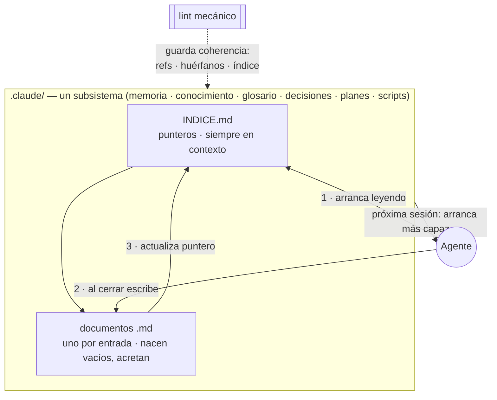

# Rework del README raíz + patrón carpeta-índice-lint + audit de sub-README

**Estado: en diseño · Creado 26-07-18.** Foco. Refinado en la sesión de `/planificar` (26-07-18). Depende del plan [Completar cobertura de lint mecánico](Completar%20cobertura%20de%20lint%20mecanico%20-%20memoria%20y%20preferencias.md) (para describir el patrón 6/6 sin excepciones).

## Objetivo

Reescribir el `README.md` raíz para que un recién llegado entienda **rápido** de qué se trata, sin ahogarse en detalle técnico. Reencuadre central ([decisión 0001](../../decisiones/INDICE.md)): **herramientas para agentes de propósito general (multipropósito)** — el usuario define el propósito del repo y los subsistemas se llenan con lo aprendido para lograrlo. Se puede instalar sobre un repo vacío **o sobre uno que ya tenga cosas**. Explicar operativamente **cómo aprende** (el patrón índice-entradas-lint) con un mermaid, y dejar cada funcionalidad con su README propio consistente.

## Reencuadre (lo que cambió en el análisis)

"Multipropósito" **NO** es portabilidad entre agentes ni producto para terceros. Es que el **mismo harness sirve a cualquier propósito**: le decís qué querés hacer (la memoria lo pregunta si hace falta) y todos los subsistemas se llenan con lo aprendido para lograrlo. Se instala sobre un repo vacío **o sobre uno existente** (idempotente/reconciliable). Ejemplos reales del usuario (van al README como gancho concreto): agente contable que maneja gnucash por MCP y sincroniza Dropbox · otro que baja y prueba modelos de IA · otro que analiza casas para mudarse.

## Decisiones registradas (esta sesión)

- **[0001](../../decisiones/INDICE.md)** — Sustrato multipropósito agnóstico al dominio (no inicializador de repos de software).
- **[0002](../../decisiones/INDICE.md)** — Patrón de subsistema: `INDICE.md` con entradas → documento de detalle o carpeta + lint. **Sin grafo** (no aporta a este tamaño). **Síntesis propia — no atribuir a Karpathy** (sin influencia formal verificable; "cero invención").
- **[0003](../../decisiones/INDICE.md)** — Integridad en dos capas: mecánica (lints) obligatoria para subsistemas con estado; semántica (contradicciones) hoy informal, pendiente.

Términos afinados en glosario: `propósito`, `multipropósito`, `subsistema`, `lint mecánico`, `chequeo semántico`.

## Estructura propuesta del README (secuencial, arriba→abajo)

1. **Qué es** — 1 párrafo: herramientas multipropósito para agentes de propósito general; le decís tu propósito y el agente construye tu dominio sesión a sesión. Se instala sobre un repo vacío o uno que ya tenga cosas.
2. **Ejemplos** — los tres casos reales (contable, modelos IA, casas): hacen tangible "multipropósito" de una.
3. **Qué te da** — agrupado por Infra / Subsistemas de acumulación / Orquestación, con nombres de habilidades y el "cómo" de cada capa.
4. **Cómo aprende (mermaid)** — el patrón índice+entradas+lint como explicación operativa; los subsistemas nacen vacíos y acretan. Las **dos capas de integridad** (mecánica / semántica) se nombran acá.
5. **Cómo se usa** — happy path con comandos exactos (registrar marketplace → instalar `setup-completo` → `inicializar-custom` en el repo → trabajar) → link a `REGISTRO.md`.
6. **Estructura del repo** — árbol podado (`funcionalidades/`, `.claude/`, `.claude-plugin/`); detalle → `CLAUDE.md`/`REGISTRO.md`.
7. **Con otro agente (no Claude Code)** — pegar el `prompt.md` agnóstico.
8. **Uso avanzado** — piezas sueltas · desarrollo local (junctions/symlinks) · repo privado/auto-update · mantenimiento → `REGISTRO.md`.

## Mermaid acordado (borrador; iterar si al render no cierra — el user está en el teléfono)

## Audit de sub-README (pase liviano, NO reescritura)

Los 10 ya existen y siguen la forma (título + párrafo → "Qué agrega al repo destino" → Dependencias → Formatos). El pase:

- **Los 6 de acumulación** (memoria, conocimiento, glosario, decisiones, planes, scripts): línea inicial que referencia el patrón índice+entradas+lint (link al README raíz). Verificar que tengan qué hace / cómo / estructura / lint.
- **preferencias-trabajo**: NO lleva la línea del patrón (no sigue índice+entradas). Aclara que es config + lint estructural (tras el plan de lints).
- **estilo-commits / setup-completo / planificar**: fuera del patrón; no se les fuerza la línea.
- Umbral: solo agregar la línea + arreglar lo flojo; no reescribir los que ya están completos.

## Alcance / archivos
- `README.md` (raíz) — reescritura según las 8 secciones.
- `funcionalidades/*/README.md` (×10) — pase de consistencia acotado.
- Coherencia con `CLAUDE.md` y `REGISTRO.md` (no duplicar; linkear). Ojo: `CLAUDE.md` línea 3 y `REGISTRO.md` abren con "marketplace de plugins de Claude Code / mis repositorios" — evaluar si armonizar con el reencuadre multipropósito o dejar (son internos).

## Verificación
- README se lee de corrido y ubica al recién llegado sin pedir contexto técnico.
- Los 6 sub-README de acumulación arrancan con el patrón; cubren qué/cómo/estructura/lint.
- Sin refs rotas a `REGISTRO.md`/`CLAUDE.md`.
- `node .claude/scripts/lint-harness/lint-harness.js` verde.
