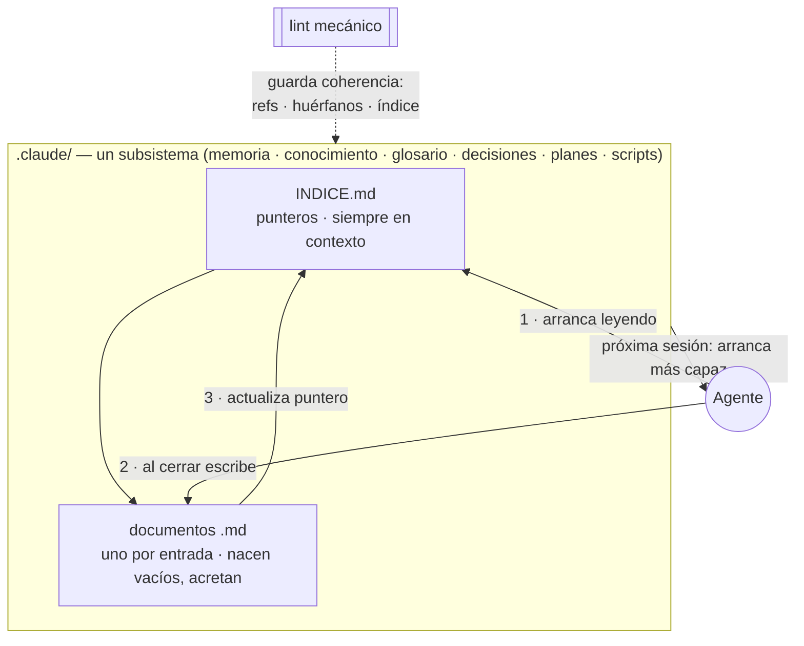

# Rework del README raíz + patrón carpeta-índice-lint + audit de sub-README

**Estado: listo · Creado 26-07-18.** Foco. Refinado en dos sesiones de `/planificar` (26-07-18). Dep [Completar cobertura de lint mecánico](../ejecutados/Completar%20cobertura%20de%20lint%20mecanico%20-%20memoria%20y%20preferencias.md) **ya cerrada**: el patrón es 6/6 sin excepciones.

## Objetivo

Reescribir el `README.md` raíz para que un recién llegado entienda **rápido** de qué se trata, sin ahogarse en detalle técnico. Reencuadre central ([decisión 0001](../../decisiones/INDICE.md)): **herramientas para agentes de propósito general (multipropósito)** — el usuario define el propósito del repo y los subsistemas se llenan con lo aprendido para lograrlo. Se puede instalar sobre un repo vacío **o sobre uno que ya tenga cosas**. Explicar operativamente **cómo aprende** (el patrón índice-entradas-lint) con un mermaid, y dejar cada funcionalidad con su README propio consistente.

## Reencuadre (lo que cambió en el análisis)

"Multipropósito" **NO** es portabilidad entre agentes ni producto para terceros. Es que el **mismo harness sirve a cualquier propósito**: le decís qué querés hacer (la memoria lo pregunta si hace falta) y todos los subsistemas se llenan con lo aprendido para lograrlo. Se instala sobre un repo vacío **o sobre uno existente** (idempotente/reconciliable). Ejemplos reales del usuario (van al README como gancho concreto): agente contable que maneja gnucash por MCP y sincroniza Dropbox · otro que baja y prueba modelos de IA · otro que analiza casas para mudarse.

## Decisiones registradas (esta sesión)

- **[0001](../../decisiones/INDICE.md)** — Sustrato multipropósito agnóstico al dominio (no inicializador de repos de software).
- **[0002](../../decisiones/INDICE.md)** — Patrón de subsistema: `INDICE.md` con entradas → documento de detalle o carpeta + lint. **Sin grafo** (no aporta a este tamaño). **Síntesis propia — no atribuir a Karpathy** (sin influencia formal verificable; "cero invención").
- **[0003](../../decisiones/INDICE.md)** — Integridad en dos capas: mecánica (lints) obligatoria para subsistemas con estado; semántica (contradicciones) hoy informal, pendiente.

Términos afinados en glosario: `propósito`, `multipropósito`, `subsistema`, `lint mecánico`, `chequeo semántico`.

## Estructura propuesta del README (secuencial, arriba→abajo)

1. **Qué es** — 1 párrafo: herramientas multipropósito para agentes de propósito general; le decís tu propósito y el agente construye tu dominio sesión a sesión. Se instala sobre un repo vacío o uno que ya tenga cosas.
2. **Ejemplos** — los tres casos reales (contable, modelos IA, casas): hacen tangible "multipropósito" de una.
3. **Qué te da** — agrupado por Infra / Subsistemas de acumulación / Orquestación, con nombres de habilidades y el "cómo" de cada capa.
4. **Cómo aprende (mermaid)** — el patrón índice+entradas+lint como explicación operativa; los subsistemas nacen vacíos y acretan. Las **dos capas de integridad** (mecánica / semántica) se nombran acá.
5. **Cómo se usa** — happy path con comandos exactos (registrar marketplace → instalar `setup-completo` → `inicializar-custom` en el repo → trabajar) → link a `REGISTRO.md`.
6. **Estructura del repo** — árbol podado (`funcionalidades/`, `.claude/`, `.claude-plugin/`); detalle → `CLAUDE.md`/`REGISTRO.md`.
7. **Con otro agente (no Claude Code)** — pegar el `prompt.md` agnóstico.
8. **Uso avanzado** — piezas sueltas · desarrollo local (junctions/symlinks) · repo privado/auto-update · mantenimiento → `REGISTRO.md`.

**Altitud (2ª sesión):** se conservan las 8 secciones (README autocontenido), pero 7-8 quedan **marcadas explícitamente como avanzado** al final: el que skimea corta antes de llegar; el que necesita el detalle lo tiene sin saltar a otro archivo. No se podan a `REGISTRO.md`.

## Mermaid — validar render antes de escribir el README (2ª sesión)

Es un formato nuevo y visual. **Antes** de reescribir el README: renderizar el mermaid a imagen y mandárselo al usuario para aprobar/corregir (está en el teléfono; evita commitear un diagrama que en GitHub no cierra). Recién con el OK se escribe el README. Borrador acordado abajo (iterar sobre él si el render no cierra).

## Audit de sub-README (pase liviano, NO reescritura)

Los 10 ya existen y siguen la forma (título + párrafo → "Qué agrega al repo destino" → Dependencias → Formatos). El pase:

- **Los 6 de acumulación** (memoria, conocimiento, glosario, decisiones, planes, scripts): línea inicial que referencia el patrón índice+entradas+lint (link al README raíz). Verificar que tengan qué hace / cómo / estructura / lint.
- **preferencias-trabajo**: NO lleva la línea del patrón (no sigue índice+entradas). Aclara que es config + lint estructural (tras el plan de lints).
- **estilo-commits / setup-completo / planificar**: fuera del patrón; no se les fuerza la línea.
- Umbral: solo agregar la línea + arreglar lo flojo; no reescribir los que ya están completos.

## Alcance / archivos
- `README.md` (raíz) — reescritura según las 8 secciones.
- `funcionalidades/*/README.md` (×10) — pase de consistencia acotado.
- **`CLAUDE.md` → Objetivo** — reescribir del encuadre viejo ("inicializar rápido mis repositorios con mis preferencias") al **multipropósito** (decisión 0001). Definido en la 2ª sesión: armonizar, no dejar — dejarlo divergente crearía una contradicción semántica público/interno.
- **`REGISTRO.md` línea 3** — reencuadrar la apertura ("Catálogo de lo que este repo puede instalar en un proyecto nuevo") al mismo encuadre multipropósito.
- Coherencia general con `CLAUDE.md`/`REGISTRO.md`: no duplicar, linkear.
- **Fuera de alcance:** el nombre del repo/carpeta ("Inicializador de Repos Custom") queda — renombrar rompe los targets de los junctions y las rutas; es etiqueta, no encuadre. Si se quiere, es su propio plan.

## Notas de implementación

Ejecutado 26-07-18.

- **Diagramas:** el mermaid se partió en **dos** (decidido en sesión, no estaba en el borrador): diagrama 1 = bucle de aprendizaje de alto nivel (propósito → trabajar → aprender → persistir → más capaz, con retorno "compone"); diagrama 2 = mecanismo índice + entradas + lint. Aprobados por render antes de escribir. Quedaron como primera iteración.
- **README raíz:** reescrito a las 8 secciones; cola avanzada (7-8) separada con regla + nota "saltalas si solo querés instalar".
- **Armonización:** Objetivo de `CLAUDE.md` y apertura de `REGISTRO.md` al encuadre multipropósito (decisión 0001).
- **6 sub-README de acumulación:** línea del patrón con link a `README#cómo-aprende`. En conocimiento se sacó "grafo" (chocaba con decisión 0002).
- **Terminología:** durante la ejecución se coló "acretar" (palabra inventada); el usuario lo marcó → decisión **0004 ampliada** (español corriente en todo, ratificada) + plan estacionado *Propagar guardarraíl al harness*.
- **Detectado de paso:** README de `setup-completo` stale (dice 4, instala 8) → plan estacionado propio.
- **Lints:** harness, preferencias, decisiones, planes — todos verdes.

## Verificación
- Mermaid renderizado y aprobado por el usuario **antes** de escribir el README.
- README se lee de corrido y ubica al recién llegado sin pedir contexto técnico; secciones 7-8 marcadas como avanzado.
- CLAUDE.md (Objetivo) y REGISTRO.md (apertura) armonizados al encuadre multipropósito: sin contradicción con la decisión 0001 ni entre público/interno.
- Los 6 sub-README de acumulación arrancan con el patrón; cubren qué/cómo/estructura/lint.
- Sin refs rotas a `REGISTRO.md`/`CLAUDE.md`.
- `node .claude/scripts/lint-harness/lint-harness.js` verde.
