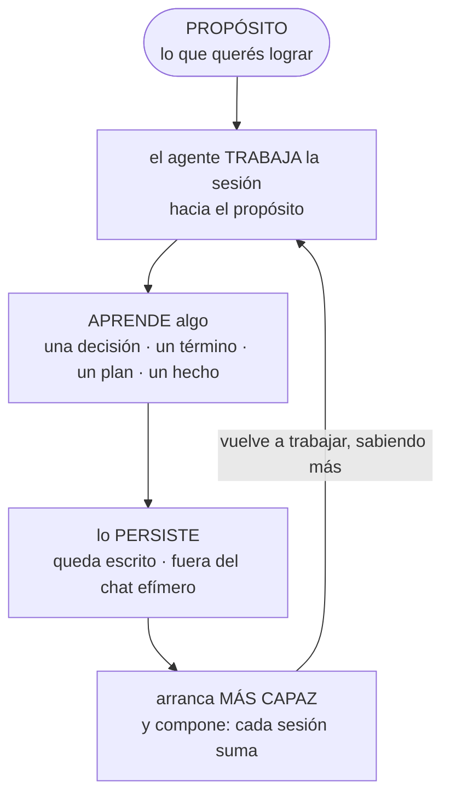
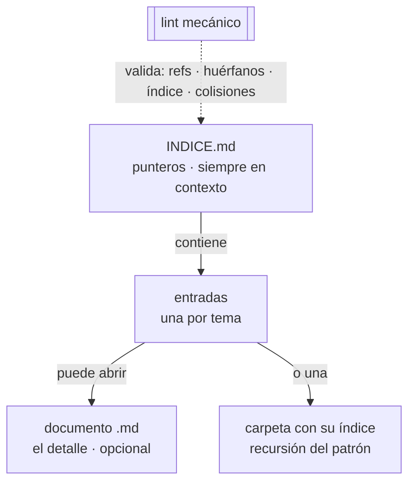

# Inicializador de Repos Custom — jllarens

Funcionalidades para agentes de código de **propósito general**. Vos le decís al repo **qué querés lograr** (llevar la contabilidad, analizar dónde mudarte, probar modelos de IA) y el agente construye ese dominio **sesión a sesión**: aprende algo, lo persiste fuera de la memoria efímera del chat, y por eso la próxima vez arranca más capaz. El mismo setup sirve a cualquier propósito.

Se instala sobre un **repo vacío** o sobre uno que **ya tenga cosas** — es idempotente y reconciliable: inspecciona lo que hay, agrega lo que falta y no pisa lo que difiere.

## Ejemplos

El propósito lo ponés vos. Tres reales:

- **Contable** — un agente que lleva las cuentas en GnuCash (por MCP) y sincroniza los archivos por Dropbox. Su glosario son las cuentas y categorías; sus decisiones, los criterios de imputación.
- **Modelos de IA** — un agente que baja modelos, los prueba y anota qué anduvo. Su conocimiento son los benchmarks; sus planes, la cola de experimentos.
- **Mudanza** — un agente que analiza casas para elegir dónde mudarse. Su glosario son los barrios y criterios; sus decisiones, los descartes y por qué.

Mismo harness, tres dominios. Lo que cambia es lo que se acumula adentro.

## Qué te da

Diez funcionalidades, cada una instalable suelta o todas juntas. En tres capas:

- **Base (siempre en contexto):**
  - **preferencias-trabajo** — cómo trabaja el agente (comunicación + principios), versionadas e importadas siempre al contexto.
  - **memoria-local** — `memoria/` + índice `MEMORIA.md`: un `.md` por hecho, tipado. Es la infraestructura sobre la que se apoyan las demás.
- **Subsistemas que acumulan** (patrón índice + entradas + lint, ver [Cómo aprende](#cómo-aprende)):
  - **conocimiento** — lo que el agente sabe del dominio.
  - **glosario** — la terminología del dominio (conceptos + alias registrados).
  - **decisiones** — las decisiones estructurales, para no re-decidir ni contradecir.
  - **gestion-de-planes** — el ciclo pendientes → ejecutados / descartados, con registro.
  - **scripts** — cada herramienta en su carpeta, ordenada en un registro.
  - **estilo-commits** — convención de commits (español, sin co-autoría de IA), como memoria.
- **Orquestación:**
  - **setup-completo** — arma el setup estándar de una pasada (skill `inicializar-custom`).
  - **planificar** — sesión de análisis que interroga un plan contra la sabiduría del repo.

## Cómo aprende

El corazón del harness es un **bucle de aprendizaje**: hay un propósito, el agente trabaja hacia él, aprende algo (una decisión, un término, un plan, un hecho), lo **persiste** por escrito, y por eso arranca más capaz la próxima vez — y **compone**: cada sesión suma sobre la anterior.



Para que ese "lo persiste" sea confiable, cada subsistema sigue el mismo **patrón índice + entradas + lint**. Un `INDICE.md` (siempre en contexto) contiene **entradas**; cada entrada puede abrir un **documento** de detalle (opcional) o una **carpeta con su propio índice** (recursión). Un **lint mecánico** valida la coherencia — sin LLM, sin red.



Los subsistemas **nacen vacíos** y se van llenando con lo aprendido. La integridad tiene dos capas: la **mecánica** (los lints, obligatoria para todo subsistema que persiste estado) y la **semántica** (contradicciones, duplicación, staleness — requiere entender el significado; hoy informal).

## Cómo se usa

El camino cómodo, con Claude Code, parado en la raíz del repo a inicializar:

```shell
# 1. Registrar el marketplace (una vez, con git autenticado contra el repo)
/plugin marketplace add XelNagah/personal-claude-harness

# 2. Instalar el orquestador
/plugin install setup-completo@xelnagah-harness

# 3. En el repo a inicializar, invocar el skill
inicializar-custom
```

A partir de ahí, trabajás normal: el agente lee sus índices al arrancar y escribe lo aprendido al cerrar. El catálogo completo de funcionalidades, dependencias y nombres de skill está en [REGISTRO.md](REGISTRO.md).

## Estructura del repo

```
├── README.md                  # este archivo
├── REGISTRO.md                # catálogo de funcionalidades
├── .claude/                   # el propio setup, aplicado a este repo
│   ├── CLAUDE.md              # instrucciones internas
│   ├── memoria/ preferencias/ planes/ conocimiento/ glosario/ decisiones/ scripts/
│   └── ...                    # cada subsistema con su índice + lint
├── .claude-plugin/
│   └── marketplace.json       # catálogo del marketplace (10 plugins)
└── funcionalidades/           # cada subcarpeta = un plugin
    └── <nombre>/              # plugin.json + README + prompt.md + skills/<skill>/
```

El detalle de cada funcionalidad vive en su `funcionalidades/<nombre>/README.md`; el de la mecánica interna, en [`.claude/CLAUDE.md`](.claude/CLAUDE.md) y [REGISTRO.md](REGISTRO.md).

---

_Las dos secciones que siguen son de uso avanzado — saltalas si solo querés instalar y usar._

## Con otro agente (no Claude Code)

Cada funcionalidad existe en **dos formatos** intercambiables:

- **Skill / plugin** — para Claude Code, instalable por marketplace e invocable por nombre.
- **Prompt agnóstico** — el `funcionalidades/<nombre>/prompt.md`: texto para pegar a cualquier agente (Codex, Cursor, Copilot, Gemini CLI…), que arma el equivalente en su propio harness.

Para usar el harness con otro agente, pegá el `prompt.md` de la funcionalidad que quieras.

## Uso avanzado

- **Piezas sueltas** — cada funcionalidad se instala sola: `/plugin install gestion-de-planes@xelnagah-harness`, o su skill `inicializar-<nombre>`, o su `prompt.md`.
- **Desarrollo local (junctions / symlinks)** — en esta máquina los 10 skills están enlazados por **junction** (NTFS) desde `~/.claude/skills/` hacia cada `funcionalidades/<n>/skills/<skill>` — fuente única para editar en vivo sin pasar por el cache de plugins. En Linux/macOS el equivalente es `ln -s`. No mezclar enlace + plugin del mismo skill en una máquina (colisionan por nombre).

  ```powershell
  New-Item -ItemType Junction `
    -Path   "$env:USERPROFILE\.claude\skills\inicializar-custom" `
    -Target "<ruta-repo>\funcionalidades\setup-completo\skills\inicializar-custom"
  ```

- **Repo privado / auto-update** — el install es un `git clone` por debajo; alcanza con git autenticado (`gh auth login` o SSH). Para auto-update en background, exportar `GITHUB_TOKEN` con scope `repo`.
- **Mantenimiento** — cómo agregar una funcionalidad, propagar un cambio a los dos formatos y validar el marketplace: en [REGISTRO.md](REGISTRO.md) y [`.claude/CLAUDE.md`](.claude/CLAUDE.md).
