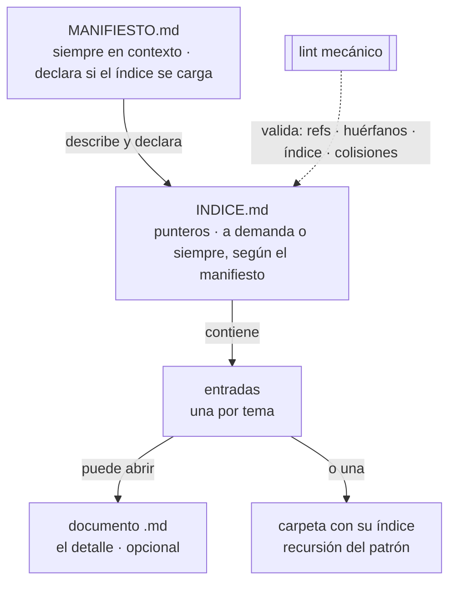

# Agente Multipropósito — AMP

Setup estándar para agentes de código de **propósito general**. Vos le decís al repo **qué querés lograr** (llevar la contabilidad, analizar dónde mudarte, probar modelos de IA) y el agente construye ese dominio **sesión a sesión**: aprende algo, lo persiste fuera de la memoria efímera del chat, y por eso la próxima vez arranca más capaz. El mismo setup sirve a cualquier propósito.

Se instala sobre un **repo vacío** o sobre uno que **ya tenga cosas** — es idempotente y reconciliable: inspecciona lo que hay, agrega lo que falta y no pisa lo que difiere.

## Ejemplos

El propósito lo ponés vos. Tres reales:

- **Contable** — un agente que lleva las cuentas en GnuCash (por MCP) y sincroniza los archivos por Dropbox. Su glosario son las cuentas y categorías; sus decisiones, los criterios de imputación.
- **Modelos de IA** — un agente que baja modelos, los prueba y anota qué anduvo. Su conocimiento son los benchmarks; sus planes, la cola de experimentos.
- **Mudanza** — un agente que analiza casas para elegir dónde mudarse. Su glosario son los barrios y criterios; sus decisiones, los descartes y por qué.

Mismo harness, tres dominios. Lo que cambia es lo que se acumula adentro.

## Qué te da

**Ocho subsistemas** en el `.claude/` del repo. Todos siguen el mismo patrón (ver [Cómo aprende](#cómo-aprende)) y nacen vacíos:

| Subsistema | Qué acumula |
|------------|-------------|
| **subsistemas** | Catálogo de casas persistentes y coordinación del Aprendizaje |
| **preferencias** | Cómo trabaja el agente: comunicación y principios, versionados en Base + Adaptaciones |
| **planes** | El ciclo pendientes → ejecutados / descartados, con registro y estados configurables |
| **conocimiento** | Lo que el agente **sabe** del dominio: lo que costó averiguar y va a hacer falta de nuevo |
| **semántica** | La terminología del dominio: glosario de términos legítimos + registro de los vetados |
| **decisiones** | Las decisiones estructurales, para no re-decidir ni contradecir lo ya resuelto |
| **herramientas** | Las tools que el propósito del repo requiere (script, skill local, MCP), en un registro |
| **conducta** | Reglas "cuando hagas X, asegurate de Y", que un hook entrega en el momento justo |

Se distribuye como **9 plugins**: el transversal `amp` más uno por cada subsistema. Instalás `amp` y los otros ocho entran como dependencias — una instalación por repo.

| Plugin | Skills |
|--------|--------|
| `amp` | `inicializar` (arma el `.claude/` completo) · `planificar` (analiza un plan contra lo que el repo sabe) · `info` (estado) · `actualizar` (pone al día una instalación vieja) |
| `amp-subsistemas` | `agregar-subsistema`, `reubicar-aprendizaje` |
| `amp-preferencias` | `registrar-preferencia` |
| `amp-planes` | `ciclo-de-plan` |
| `amp-conocimiento` | `registrar-conocimiento` · `buscar-conocimiento` |
| `amp-semantica` | `converger-terminologia` |
| `amp-decisiones` | `registrar-decision` |
| `amp-herramientas` | `registrar-herramienta` |
| `amp-conducta` | `registrar-regla` |

`commits` no es un noveno subsistema: el texto del estilo vive en Preferencias y Conducta lo entrega en el momento de confirmar.

## Cómo aprende

El corazón del harness es un **bucle de aprendizaje**: hay un propósito, el agente trabaja hacia él, aprende algo (una decisión, un término, un plan, un hecho), lo **persiste** por escrito, y por eso arranca más capaz la próxima vez — y **compone**: cada sesión suma sobre la anterior.


```mermaid
flowchart TD
    P(["PROPÓSITO<br/>lo que querés lograr"])
    W["el agente TRABAJA la sesión<br/>hacia el propósito"]
    L["APRENDE algo<br/>una decisión · un término · un plan · un hecho"]
    S["lo PERSISTE<br/>queda escrito · fuera del chat efímero"]
    C["arranca MÁS CAPAZ<br/>y compone: cada sesión suma"]
    P --> W
    W --> L
    L --> S
    S --> C
    C -->|vuelve a trabajar, sabiendo más| W
```

Para que ese "lo persiste" sea confiable, cada subsistema sigue el mismo **patrón manifiesto + índice + entradas + lint**. El **manifiesto** es una descripción breve —qué es el subsistema, cuándo consultarlo, cuándo escribirlo— que va **siempre en contexto** y que además declara si su índice se carga o no. El `INDICE.md` contiene **entradas**; cada entrada puede abrir un **documento** de detalle (opcional) o una **carpeta con su propio índice** (recursión). Un **lint mecánico** valida la coherencia — sin LLM, sin red.


```mermaid
flowchart TD
    M["MANIFIESTO.md<br/>siempre en contexto · declara si el índice se carga"]
    IDX["INDICE.md<br/>punteros · a demanda o siempre, según el manifiesto"]
    E["entradas<br/>una por tema"]
    D["documento .md<br/>el detalle · opcional"]
    F["carpeta con su índice<br/>recursión del patrón"]
    LINT[["lint mecánico"]]
    M -->|describe y declara| IDX
    IDX -->|contiene| E
    E -->|puede abrir| D
    E -->|o una| F
    LINT -.->|valida: refs · huérfanos · índice · colisiones| IDX
```

Ese modelo de carga existe por una razón concreta: si todos los índices fueran siempre a contexto, el registro de planes solo ya se comería la mitad del arranque. Lo que va siempre es la descripción liviana; el índice pesado se consulta cuando hace falta.

La integridad tiene dos capas: la **mecánica** (los lints, obligatoria para todo subsistema que persiste estado) y la **semántica** (contradicciones, duplicación, desactualización — requiere entender el significado; hoy informal).

## Cómo se usa

Con Claude Code, parado en el repo que querés inicializar:

```shell
# 1. Registrar el marketplace (una vez por máquina)
claude plugin marketplace add XelNagah/personal-claude-harness

# 2. Instalar el plugin transversal (trae los 6 por subsistema como dependencias)
claude plugin install amp@xelnagah-harness -s local
```

Reiniciás la sesión y le pedís al agente:

```
amp:inicializar
```

Te va a preguntar qué querés lograr en ese repo, y arma el `.claude/` completo. A partir de ahí trabajás normal: al arrancar la sesión el agente ve el estado del repo y sus manifiestos, y escribe lo aprendido a medida que aparece.

## Actualizar

En un repo que ya tiene el Agente Multipropósito, pedile al agente:

```
amp:actualizar
```

Es el único punto de entrada. Primero verifica el marketplace y los plugins; solo pide reiniciar si cambió lo que está cargado. Después nivela la Base. Si encuentra una generación retirada, como `memoria/`, instala la casa nueva, retira automáticamente la infraestructura y los duplicados Base conocidos, y pregunta pieza por pieza solo por el Aprendizaje del Propósito: nunca informa “al día” mientras la migración siga pendiente.

📄 **[Manual de instalación completo](docs/INSTALAR.md)** — paso a paso, actualización, instalación para Codex / Cursor / Gemini, y problemas frecuentes.

El catálogo completo de funcionalidades, dependencias y nombres de skill está en [REGISTRO.md](REGISTRO.md).

## Estructura del repo

```
├── README.md                  # este archivo
├── AGENTS.md                  # instrucciones para agentes (fuente única)
├── CLAUDE.md                  # adaptador Claude Code: @AGENTS.md
├── REGISTRO.md                # catálogo de funcionalidades
├── docs/                      # documentación para humanos
│   └── INSTALAR.md            # manual de instalación y actualización
├── .claude/                   # el propio setup, aplicado a este repo
│   ├── subsistemas/ preferencias/ planes/ conocimiento/ semantica/
│   ├── decisiones/ herramientas/ conducta/
│   └── ...                    # cada subsistema con su manifiesto, índice y lint
├── .claude-plugin/
│   └── marketplace.json       # catálogo del marketplace (9 plugins)
└── funcionalidades/           # cada subcarpeta = un plugin
    └── <nombre>/              # plugin.json + README + skills/<skill>/
```

El detalle de cada funcionalidad vive en su `funcionalidades/<nombre>/README.md`; el de la mecánica interna, en [`AGENTS.md`](AGENTS.md) y [REGISTRO.md](REGISTRO.md).

---

_Las dos secciones que siguen son de uso avanzado — saltalas si solo querés instalar y usar._

## Claude Code y Codex CLI

El harness soporta **Claude Code** y **Codex CLI**. Ambos leen `AGENTS.md`; Claude Code entra por el adaptador `CLAUDE.md` (`@AGENTS.md`). Las Habilidades se instalan como Plugins del marketplace. Claude Code instala `amp` y sus dependencias; Codex usa el instalador incluido porque su comando no resuelve dependencias.

## Uso avanzado

- **El conjunto entra completo** — no se instalan piezas sueltas: `amp` trae los seis `amp-<sub>` por dependencias, en alcance `project`. Es a propósito — el harness aplica a los repos que lo usan, no a todos los que abras.
- **Codex CLI** — después de registrar el marketplace, ejecutar `node <checkout-harness>/.claude/herramientas/instalar-plugins-codex/instalar-plugins-codex.js --aplicar` para instalar el paquete completo.

- **Actualización automática** — el install es un `git clone` por debajo. Este repo es público, así que no hace falta autenticación; si lo forkeás en privado, exportá `GITHUB_TOKEN` con alcance `repo` para que la actualización en segundo plano funcione.
- **Mantenimiento** — cómo agregar una funcionalidad, propagar un cambio y validar el marketplace: en [REGISTRO.md](REGISTRO.md) y [`AGENTS.md`](AGENTS.md).
